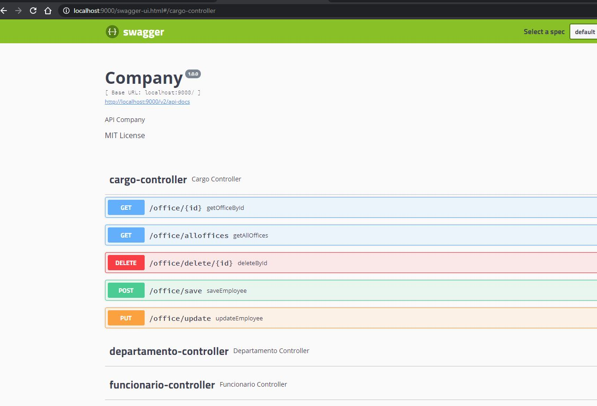

# spring-boot-jpa-swagger

## :information_source: Informações do desafio

Construa o código que contemple as seguintes operações expostas como endpoints REST para:

* Cadastrar funcionario
* Cadastrar cargo
* Cadastrar departamento
* Consultar funcionario
* Consultar funcionario pelo codigo do departamento
* Remover funcionario
* Remover cargo
* Remover departamento

Considere o cadastro com dados básicos:

* funcionario: nome, idade, ...
* cargo: nome
* departamento: nome

## :rocket: Tecnologias Utilizadas 

```
- Java 8
- Maven
- Spring Boot
- JPA
- Hibernate
- Database H2
```

## :iphone: Telas

<p align="center">

</p>

<p align="center">

</p>

<p align="center">

</p>

<p align="center">

</p>

<p align="center">

</p>

<p align="center">

</p>

<p align="center">

</p>

<p align="center">

</p>
